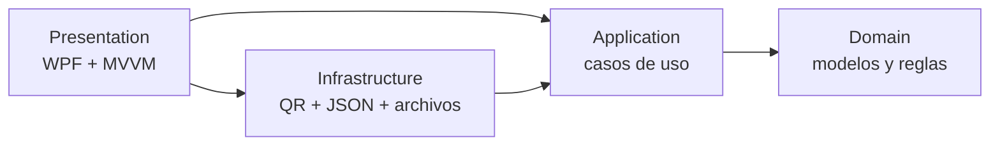

<div align="center">


# QR Studio

### Crea · Personaliza · Comparte

Aplicación de escritorio para generar, personalizar, exportar y administrar códigos QR.

[](https://dotnet.microsoft.com/)
[](https://learn.microsoft.com/dotnet/desktop/wpf/)
[](docs/ARCHITECTURE.md)
[](docs/ROADMAP.md)

</div>

## Descripción

**QR Studio** es la reconstrucción completa de **GeneradorQR**, una antigua tarea académica desarrollada con Windows Forms y .NET Framework 4.7.1.

El proyecto original permitía convertir un texto en una imagen QR. Esta nueva versión conserva esa idea central, pero la transforma en una aplicación de portafolio con una identidad propia, interfaz moderna, arquitectura modular, MVVM, persistencia local y pruebas automatizadas.

## Funcionalidades

### Versión inicial

- Generación de códigos QR para texto, sitios web, correo, teléfono y SMS.
- Personalización de color principal, fondo, escala y zona de seguridad.
- Selección del nivel de corrección de errores.
- Vista previa nítida dentro de la aplicación.
- Exportación en formato PNG.
- Historial local persistente.
- Reutilización, copia y eliminación de configuraciones guardadas.
- Interfaz oscura responsive para escritorio.

### Próximas versiones

- Lectura de QR desde imagen, cámara o portapapeles.
- Contenidos Wi-Fi, vCard, ubicación y eventos.
- Exportación SVG y PDF.
- Logotipo central con validación de legibilidad.
- Plantillas y favoritos.
- Empaquetado MSIX e instalador firmado.

Consulta el [roadmap completo](docs/ROADMAP.md).

## Tecnologías

### Lenguaje y plataforma

[](https://skillicons.dev)

- C# con tipos anulables y analizadores habilitados.
- .NET 10.
- Windows Presentation Foundation.

### Arquitectura y librerías

- MVVM con CommunityToolkit.Mvvm.
- Generic Host e inyección de dependencias.
- QRCoder para renderizado PNG.
- Persistencia JSON en `%LOCALAPPDATA%\QR Studio\history.json`.
- Arquitectura en capas: Domain, Application, Infrastructure y Presentation.

### Pruebas y herramientas

[](https://skillicons.dev)

- xUnit.
- Microsoft.NET.Test.Sdk.
- Coverlet Collector.
- GitHub Actions.
- Central Package Management.

## Arquitectura



Las dependencias apuntan hacia el núcleo. La interfaz no conoce detalles de QRCoder ni del formato físico del historial. Consulta [ARCHITECTURE.md](docs/ARCHITECTURE.md) para las decisiones y límites de cada capa.

## Estructura

```text
QRStudio/
├── src/
│   ├── QRStudio.Domain/
│   ├── QRStudio.Application/
│   ├── QRStudio.Infrastructure/
│   └── QRStudio.Presentation/
├── tests/
│   ├── QRStudio.Application.Tests/
│   └── QRStudio.Infrastructure.Tests/
├── docs/
├── .github/workflows/
└── QRStudio.sln
```

## Requisitos

- Windows 10 o Windows 11.
- [.NET 10 SDK](https://dotnet.microsoft.com/download/dotnet/10.0).
- Visual Studio con la carga de trabajo **Desarrollo de escritorio de .NET**, o la CLI de .NET.

## Ejecución local

```bash
git clone https://github.com/Jairo0811/GeneradorQR.git
cd GeneradorQR
dotnet restore QRStudio.sln
dotnet build QRStudio.sln
dotnet run --project src/QRStudio.Presentation
```

## Pruebas

```bash
dotnet test QRStudio.sln --configuration Release
```

Las pruebas cubren el formateo de contenido, la orquestación del caso de uso, la generación de PNG y la persistencia del historial.

## Origen del proyecto

| Etapa | Implementación |
|---|---|
| GeneradorQR original | WinForms, .NET Framework 4.7.1, una sola pantalla |
| QR Studio | WPF, .NET 10, MVVM, arquitectura modular y pruebas |

La reconstrucción no modifica gradualmente el formulario antiguo. El código anterior permanece recuperable en el historial de Git y la solución actual comienza desde una base limpia.

## Autor

**Francis Jairo Matías Rosario**<br>
Desarrollador de software · República Dominicana

- GitHub: [@Jairo0811](https://github.com/Jairo0811)

## Licencia

La licencia pública se definirá antes de la primera versión estable.
