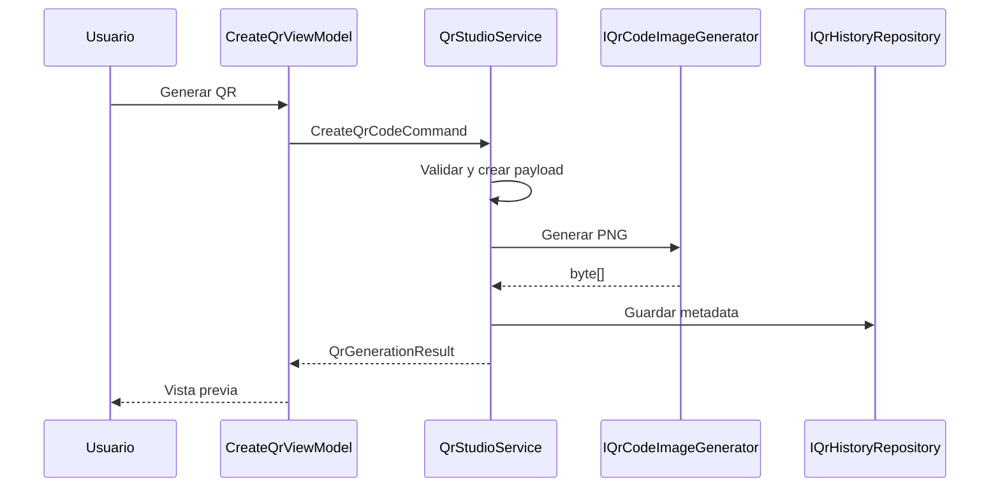

# Arquitectura de QR Studio

## Objetivo

Mantener la generación de QR independiente de la interfaz, el almacenamiento y la librería concreta de renderizado. La solución sigue una arquitectura modular ligera: suficiente para evolucionar el producto sin convertir una aplicación de escritorio pequeña en un sistema innecesariamente complejo.

## Capas

| Proyecto | Responsabilidad | Puede depender de |
|---|---|---|
| `QRStudio.Domain` | Modelos, enumeraciones y conceptos centrales | Ningún proyecto interno |
| `QRStudio.Application` | Casos de uso, validaciones, puertos y orquestación | Domain |
| `QRStudio.Infrastructure` | QRCoder, JSON, reloj y sistema de archivos | Application, Domain |
| `QRStudio.Presentation` | WPF, MVVM, navegación, diálogos y composición | Application, Domain, Infrastructure |

## Flujo de generación



## Decisiones

### Persistencia JSON local

La primera versión no necesita un motor de base de datos. El historial es pequeño, pertenece a un único usuario y no tiene relaciones complejas. Se almacena en:

```text
%LOCALAPPDATA%\QR Studio\history.json
```

La escritura utiliza un archivo temporal y reemplazo atómico para reducir el riesgo de corrupción. La abstracción `IQrHistoryRepository` permite migrar posteriormente a SQLite sin cambiar los ViewModels.

### PNG en memoria

Infrastructure devuelve bytes PNG. Presentation los convierte a `BitmapImage` para WPF y el servicio de exportación los escribe en disco. Esto evita que Application conozca tipos de interfaz o rutas físicas.

### MVVM

Los archivos code-behind solo inicializan las vistas. La interacción vive en comandos y propiedades observables. Los diálogos y el portapapeles se consumen mediante interfaces para que los ViewModels no dependan directamente de APIs estáticas.

### Sin base de datos ni API

QR Studio v1 es una aplicación local. Agregar una API o SQL Server no aportaría valor al recorrido principal y aumentaría el costo de instalación. Sincronización, cuentas o nube se evaluarán únicamente si una versión futura lo justifica.

## Reglas del núcleo

- El contenido principal es obligatorio.
- Los sitios web aceptan HTTP o HTTPS y usan HTTPS por defecto.
- Los colores usan `#RRGGBB`.
- Fondo y primer plano no pueden ser idénticos.
- La escala admite entre 3 y 30 píxeles por módulo.
- Todo QR generado se registra en el historial.
- La exportación actualiza la fecha de último guardado.

## Extensibilidad

Para agregar un nuevo tipo de contenido:

1. Añadir el valor a `QrContentType`.
2. Implementar el formato en `QrPayloadFormatter`.
3. Añadir su opción de interfaz en `CreateQrViewModel`.
4. Incorporar pruebas de formato y restauración.

Para cambiar QRCoder, basta con proporcionar otra implementación de `IQrCodeImageGenerator` y actualizar el registro de dependencias.
